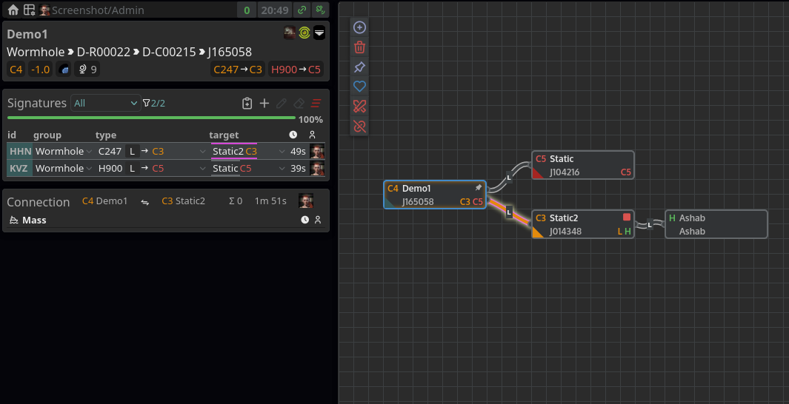

# `control-tower`

> _an elevated glass-enclosed structure which has an unobstructed view of a landing field and from which air traffic 
> may be controlled usually by radio_

> **A new wormhole mapping tool for EVE Online**

### ⚠ Alpha quality software ⚠

Control Tower is a new mapping tool for [EVE][eve-online] that is focused on mapping J-space and being familiar to 
existing users of [Pathfinder][pathfinder]. The motivation to write a new tool was **a.** _for fun_ and **b.** because 
the Pathfinder codebase was hard to understand/modify. Complete feature parity is not the primary goal - but runtime 
speed and ease of deployment certainly are.

Current state:



## Running

The github actions pipeline builds docker images for both the backend and frontend, currently only tagged `:latest`.

To run using [docker-compose]:

* Create a new [EVE Application][eve-online-developer-applications] and note the ESI client id and secret
* Create the `secret.env` file by e.g. running [`./scripts/generate-secret-env.sh > secret.env`](./scripts/generate-secret-env.sh)
* Update the `secret.env` with the values of your ESI client id and secret
* Run `docker-compose up` (look in [`compose.yaml`](./compose.yaml) for things you might want to tweak)
* Wait for the SDE import to run and go to http://localhost:8080 to login + create a map

Current minimum runtime requirements are 4GB RAM and 1 CPU, because the full [SDE][eve-online-sde] is imported and 
parsing hundreds of megabytes of YAML is memory consuming.

## Features

The feature list is intended as an overview of capabilities and current roadmap - for more details see the project view.

Currently:

* Multiple characters can log in and share a session
* Each map has granular ACL permissions
* Map canvas supports moving systems, adding new ones, creating connections
* Jumps between systems are tracked (even if a character is not actively looking at the map)
* Selecting a system gives signature scan information
* Selecting a connection gives connection jump information
* There are keyboard shortcuts available to e.g. rename or delete systems

In the future:

* [ ] Right-click context menu for common actions (such as setting the size of a connection)
* [ ] Intel information is editable (e.g. system owner) and notes
* [ ] Route calculation
* [ ] Notifications for when systems become connected
* [ ] ZKill feed
* [ ] Thera feed

## Developing

The project is almost exclusively written in the [Scala][scala-lang] 3 programming language with a functional style on 
the backend - a tutorial is sadly beyond the scope of this README. To get started with being able to run locally (e.g. 
to hack on the frontend CSS) on a Unix like system (tested on Linux only but should work in WSL 2 or on a Mac):

* Install [mise] (or [asdf]) and run either `mise install` or `asdf install` - this should bring in the JDK, `sbt` and `npm`
* Run `sbt` to bring up the build tool prompt and type `~ui/fastLinkJS` to hot-recompile the frontend `ui/` code
* In a separate terminal tab, run `cd ui && npm run dev` to bring up [vite]
* In a separate terminal tab, run `sbt server/run` (after having brought in all the appropriate environment variables)
* Open up http://localhost:8091/ - you should be able to see the login screen and your maps

The database used is [sqlite] and there are actually three separate databases that are created: `sde.db`, `map.db` and
`auth.db`. Migrations are stored in [db resources](./db/src/main/resources) and you should be able to point any SQL 
client at the database files by running:

```sqlite
ATTACH DATABASE 'path-to/map.db' as map; 
ATTACH DATABASE 'path-to/sde.db' as sde; 
ATTACH DATABASE 'path-to/auth.db' as auth;
```

### Updating static data

There are sources of data that are not included in the [SDE][eve-online-sde]:

* Signatures by group (e.g. Data site names) in [`ref_signature_in_group.csv`](./db/src/main/resources/map/reference/ref_signature_in_group.csv)
* Wormhole statics in [`ref_system_static_wormhole.csv`](./db/src/main/resources/map/reference/ref_system_static_wormhole.csv)

These have to be maintained manually.

## Contributing

If you want to get in touch, report a bug or submit some code changes please either open an issue or start a discussion.
A fuller `DEVELOPING.md` guide will probably be available eventually.

[asdf]: https://github.com/asdf-vm/asdf
[docker-compose]: https://docs.docker.com/compose/
[eve-online]: https://www.eveonline.com/
[eve-online-developer-applications]: https://developers.eveonline.com/applications
[eve-online-sde]: https://docs.esi.evetech.net/docs/sde_introduction.html
[mise]: https://github.com/jdx/mise
[pathfinder]: https://github.com/goryn-clade/pathfinder
[scala-lang]: https://scala-lang.org/
[sqlite]: https://www.sqlite.org/index.html
[vite]: https://vitejs.dev/
