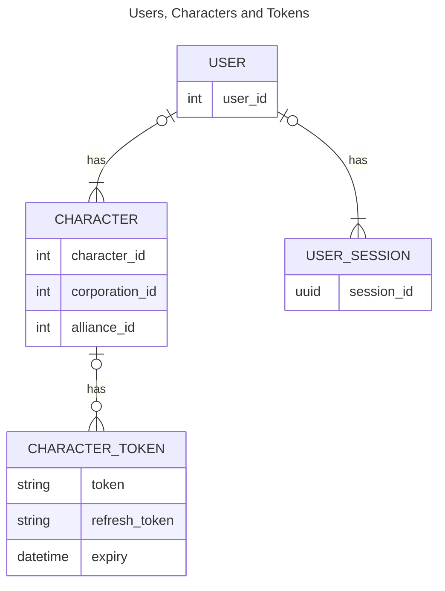
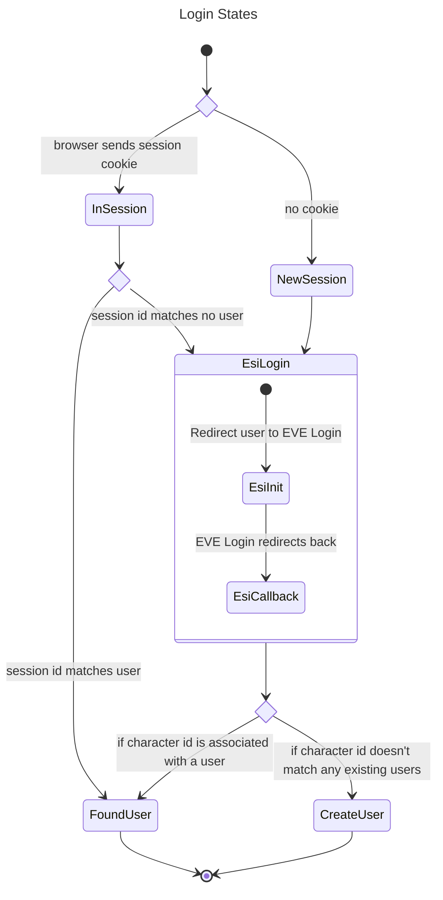

# Overview

This document talks about how sessions are managed, which is similar to other mapping tools targeting EVE Online but 
somewhat different from how typical applications manage sessions. This is mostly down to the necessity to deal with 
an identity that has multiple users (characters) that are only linked together loosely through being logged in with 
them at the same time.

The diagram below has a summary of the relationship between users, characters and other objects that are used for 
managing session state. Some details are simplified and may not reflect the database layout etc.

In summary:
 * A user can be linked to many characters
 * A character can be only linked to a single user
 * Each character has a single token that is in use for authentication through [ESI]
 * A user may be logged in to many places and so can have many sessions
 * A user only has an id - this is not exposed in the UI as something that can be interacted with directly

## Login (identifying a user)

The login process is about linking the current `session_id` (a session id is always present even if is not linked to a
user). This happens through the ESI login page which gives back a character and their oauth2 token.

There are three cases that need to be handled:
 * Login to existing user
 * Create a new user with a single new character
 * Login to existing user and add a new character

The login process distinguishes between these cases depending on whether the current session is associated with a user 
and whether the current user is associated with the character that has just logged into with ESI.

The above diagram does not show how to add a new character to an existing user for brevity - but the process begins by
logging in an existing character (to associate the current session to that user id) and going through the login process again.

[ESI]: https://esi.evetech.net